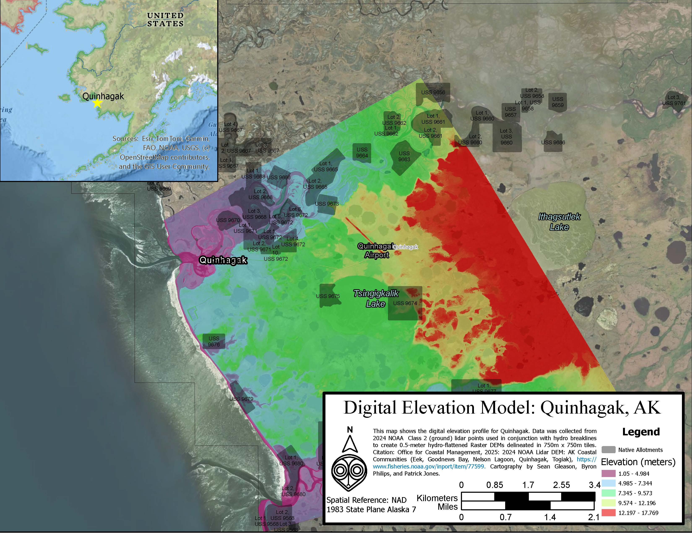

# Lesson 8: Working with Raster Data

**Duration:** 60 minutes
**Difficulty:** Intermediate
**Prerequisites:** Lesson 2 (Adding Content)

---

## Overview

Raster data (images and surfaces) requires different handling than vector data. This lesson teaches you to adjust imagery appearance using HSV and contrast controls, clip rasters to your study area, and understand raster resolution through measurement.

---

## Learning Objectives

By the end of this lesson, you will be able to:

1. ✅ Understand raster data structure (pixels/cells)
2. ✅ Adjust HSV (Hue, Saturation, Value) for imagery
3. ✅ Modify contrast and brightness
4. ✅ Clip rasters to specific extents
5. ✅ Understand and verify raster resolution
6. ✅ Combine multiple raster tiles using Mosaic to New Raster
7. ✅ Work with different raster types (imagery, DEMs, etc.)

---

## Part 1: Understanding Raster Data

### What is Raster Data?

**Structure:**
- Grid of cells (pixels)
- Each cell has a value
- Regular spacing (resolution)

**Types:**
- **Imagery:** Satellite or aerial photos
- **DEMs:** Digital Elevation Models
- **Land Cover:** Classification rasters
- **Analysis Outputs:** Density, distance, suitability maps

**Resolution:**
- Cell size (e.g., 30m, 1m, 0.3m)
- Smaller = more detail
- Larger file sizes for higher resolution

---

## Part 2: Adjusting HSV (Hue, Saturation, Value)

### What is HSV?

**Hue:** Color tone
**Saturation:** Color intensity
**Value:** Brightness

### Task 2.1: Adjust Imagery Appearance

**Access:**
1. Select raster layer in Contents
2. Appearance tab on ribbon
3. Look for imagery adjustment tools

**Hue:**
- Shift: Changes color tone
- Useful for color balancing
- -180 to +180 degrees

**Saturation:**
- Intensity of color
- 0% = grayscale
- 100% = full color
- >100% = more vivid

**Value (Brightness):**
- Overall lightness/darkness
- Adjust for visibility

**Gamma:**
- Midtone brightness
- <1 = darker midtones
- >1 = lighter midtones

**When to Adjust:**
- Imagery too dark or washed out
- Color balance off
- Want to emphasize features
- Preparing for printing

---

## Part 3: Contrast and Brightness

### Contrast Stretch

**Purpose:** Enhance visual range of pixel values

**Access:**
- Select raster layer
- Appearance tab → Symbology
- Stretch type dropdown

**Stretch Types:**

**None:**
- Raw pixel values
- Often too dark or bright

**Standard Deviation:**
- Based on statistical distribution
- Good default choice
- Adjustable (1, 2, or 3 std dev)

**Min-Max:**
- Full range from minimum to maximum values
- Maximum contrast
- May lose detail in extremes

**Percent Clip:**
- Clips extreme values
- Often gives balanced result
- Default: 0.5% each end

**Histogram Equalize:**
- Redistributes values evenly
- Good for varied terrain

**Try Different Stretches:**
- Visual preference
- Depends on data and purpose
- No single "correct" answer

---

## Part 4: Clipping Rasters to Extent

### Why Clip Rasters?

**Reasons:**
- Reduce file size
- Focus on study area
- Faster processing
- Easier to share

### Task 4.1: Clip Raster to Extent

**Method 1: Clip Raster Tool**

**Access:**
- Analysis tab → Tools
- Search: "Clip Raster"

**Parameters:**

**Input Raster:**
- Imagery or raster to clip

**Output Extent:**
- Options:
  - Draw rectangle
  - Use current display extent
  - Use feature layer extent
  - Enter coordinates

**Output Raster:**
- Name and location
- Example: `Quinhagak_Imagery_Clipped.tif`

**Clipping Geometry (optional):**
- Use polygon to clip to irregular shape
- Example: Village boundary

**NoData Value:**
- Value for areas outside extent
- Often 0 or -9999

**Run:**
- Clipped raster created
- Smaller file size
- Faster to display

**Method 2: Extract by Mask**

**For irregular shapes:**
- Search: "Extract by Mask"
- Input: Raster
- Mask: Polygon feature class
- Output shaped to polygon

---

## Part 5: Understanding Resolution

### Measuring Resolution

**From Lesson 2:** Measure known features to estimate resolution

**Check Metadata:**
1. Right-click raster layer
2. Properties
3. Source tab
4. Look for:
   - Cell Size X
   - Cell Size Y
   - Shows resolution in map units

**Common Resolutions:**

| Source | Typical Resolution |
|--------|-------------------|
| Landsat | 30m |
| Sentinel-2 | 10m |
| NAIP Aerial | 1m |
| Commercial Satellite | 0.3-0.5m |
| Drone | 0.05-0.15m |

**Is Resolution Adequate?**

**For parcel mapping:** Need ~1m or better
**For vegetation:** 10-30m often adequate
**For building details:** Need 0.3-1m
**For construction:** Need <0.15m

---

## Part 6: Combining Rasters with Mosaic to New Raster

### When to Use Mosaic Raster Tool

**Purpose:**
- Combine multiple raster datasets into one seamless raster
- Merge adjacent tiles of elevation data
- Create continuous coverage from separate files

**Common Scenarios:**
- LiDAR data downloaded as multiple tiles
- DEMs split by geographic extent
- Satellite imagery in adjacent scenes
- Combining orthomosaics from separate flights

### Understanding the Mosaic to New Raster Tool

**Watch this video explanation of the Mosaic Raster function:**

*Click the image above to watch the tutorial on YouTube*

**Example Output - Professional Elevation Map:**

*Example of final map created from mosaicked NOAA LiDAR tiles showing Quinhagak elevation with professional cartography*

### Task 6.1: Mosaic Multiple Raster Tiles

**Access:**
1. Analysis tab → Tools
2. Search: "Mosaic to New Raster"
3. Open the tool

**Parameters:**

**Input Rasters:**
- Add all raster tiles you want to combine
- Click folder icon and select multiple files
- Example: 4 LiDAR DEM tiles for Quinhagak

**Output Location:**
- Geodatabase or folder
- Example: `C:/GIS_Projects/Quinhagak/Quinhagak.gdb`

**Raster Dataset Name:**
- Name for output mosaic
- Example: `Quinhagak_DEM_Mosaic`

**Coordinate System (optional):**
- Usually inherits from input rasters
- Verify all inputs have same projection

**Pixel Type (optional):**
- Should match input data
- For elevation: typically 32-bit floating point

**Number of Bands:**
- DEMs: 1 band
- RGB imagery: 3 bands

**Mosaic Operator:**
- **FIRST:** Uses first raster's values in overlap areas
- **LAST:** Uses last raster's values in overlap areas
- **MEAN:** Averages overlapping values (recommended for DEMs)
- **MAXIMUM:** Takes highest value
- **MINIMUM:** Takes lowest value

**For LiDAR DEMs:** Use **MEAN** to blend seamlessly

**Mosaic Colormap Mode:**
- Usually "FIRST" or "MATCH"
- Less critical for elevation data

**Run:**
- Tool creates single continuous raster
- Check output for seamless blending
- Verify no obvious tile boundaries

### Best Practices

**Before Mosaicking:**
- Ensure all inputs have same projection
- Check that cell sizes match
- Verify data types are compatible

**After Mosaicking:**
- Inspect overlap areas for artifacts
- Check that values make sense
- Compare with original tiles

**File Management:**
- Keep original tiles as backup
- Name mosaic clearly
- Document source data

---

## Part 7: Working with DEMs (Digital Elevation Models)

### Understanding DEMs

**Purpose:**
- Represent elevation
- Each cell = elevation value
- Used for terrain analysis

**Applications:**
- Slope calculation
- Viewshed analysis
- Drainage modeling
- 3D visualization

### Hillshade Visualization

**Makes DEM easier to interpret:**

**Access:**
- Select DEM layer
- Appearance tab → Symbology
- Choose "Hillshade"

**Parameters:**
- Azimuth: Sun direction (default 315°)
- Altitude: Sun angle above horizon (default 45°)
- Z Factor: Vertical exaggeration

**Result:**
- 3D-looking terrain
- Easy to see landforms
- Better than raw elevation values

---

## Part 8: Raster vs Vector

### When to Use Each

**Raster:**
- Continuous surfaces (elevation, temperature)
- Imagery and photos
- Analysis outputs (density, cost distance)
- Large regional datasets

**Vector:**
- Discrete features (buildings, roads, parcels)
- Precise boundaries
- Attribute-rich data
- Network analysis

**Often Use Together:**
- Vector features on raster basemap
- Extract raster values to vector points
- Clip raster by vector boundary

---

## Part 9: Practical Exercise

### Exercise: Imagery Enhancement and Clipping

**Goal:** Prepare Quinhagak imagery for analysis

**Tasks:**

1. **Add Imagery:**
   - Add Quinhagak satellite or aerial imagery

2. **Check Resolution:**
   - Properties → Source → Cell Size
   - Record resolution
   - Verify adequate for your purpose

3. **Adjust Appearance:**
   - Try different contrast stretches
   - Adjust brightness if needed
   - Modify saturation for better visibility
   - Find best visualization

4. **Clip to Village:**
   - Use Clip Raster tool
   - Extent: Quinhagak boundary polygon
   - Create clipped output

5. **Compare:**
   - Original vs clipped file size
   - Display performance
   - Appearance

**Deliverable:**
- Well-displayed imagery
- Clipped to study area
- Optimized for analysis
- Documented resolution

---

## Summary

### Key Concepts

1. **Raster Data:** Grid of cells with values
2. **HSV:** Hue, Saturation, Value adjustments
3. **Contrast Stretch:** Enhance visual range
4. **Clipping:** Reduce to study area
5. **Resolution:** Cell size determines detail
6. **Raster vs Vector:** Different purposes

### Common Tasks

- Adjust appearance: Appearance tab → Image controls
- Clip raster: Clip Raster or Extract by Mask tool
- Check resolution: Layer Properties → Source
- Hillshade DEM: Symbology → Hillshade

### Best Practices

- Clip large rasters to study area
- Adjust display for visibility
- Understand resolution limitations
- Document raster sources and dates
- Save processed rasters with clear names

---

**Lesson Version:** 1.0  
**Last Updated:** November 2025  
**Module:** 4 - Spatial Analysis in ArcGIS Pro
