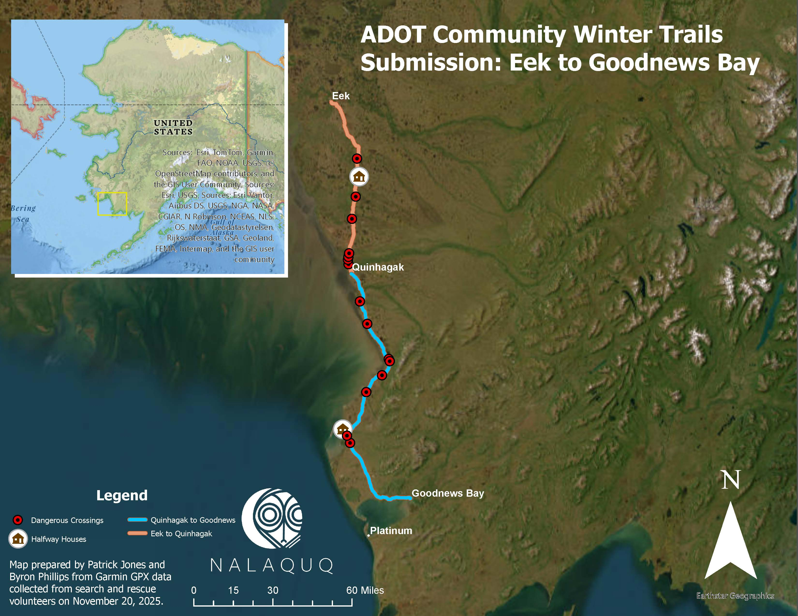

# Module 5: Cartography with ArcGIS Online

## Creating Professional Maps for Community Planning and Communication

**Duration:** 2-3 days
**Prerequisites:** Module 1 (ArcGIS Online Basics)
**Platform:** ArcGIS Online Web Map
**Setting:** Red Building training room
**Training Date:** November 8, 2025

---

## Overview

This module introduces cartography principles and map-making using ArcGIS Online's Web Map application and ArcGIS Pro. You'll learn to create professional maps using vector data (points, lines, and polygons), access publicly available layers, design effective visualizations, and export publication-ready maps. The module progresses from interactive web maps in ArcGIS Online to advanced static map production in ArcGIS Pro.

By the end of this module, you'll be able to create clear, informative maps that communicate spatial information effectively to community members, tribal councils, and partner organizations, in both interactive and static formats.

**📋 [View Example Maps](./resources/example-maps/)** - Review professional maps created for Quinhagak projects to see cartographic principles in action.

---

## Real-World Scenarios

### Scenario 1: Typhoon Merbok Damage Assessment

**The Task:** Document damage from Typhoon Merbok including coastal erosion, damaged fish racks, and sewer infrastructure impacts.

**Map Elements:**
- Point features: Damaged fish racks, sewer damage locations
- Polygon features: Erosion areas
- Context layers: Community infrastructure, coastline
- Map purpose: Damage documentation for recovery efforts

### Scenario 2: Proposed Village Relocation Planning

**The Task:** Create planning map for potential village relocation site near Quinhagak airport.

**Map Elements:**
- Polygon features:
  - Areas for UAS orthomosaic collection
  - Proposed infrastructure sites (water treatment plant)
- Line features:
  - Proposed sewer lines
  - Proposed road network
- Map purpose: Site planning and stakeholder communication

---

## Learning Objectives

By the end of this module, you will be able to:

1. ✅ Navigate the ArcGIS Online Web Map interface
2. ✅ Understand vector data types (points, lines, polygons)
3. ✅ Access and add publicly available layers
4. ✅ Create custom point, line, and polygon layers
5. ✅ Digitize features on maps
6. ✅ Style and symbolize vector data effectively
7. ✅ Apply cartographic design principles
8. ✅ Add and configure map elements (scale bar, north arrow, legend)
9. ✅ Export maps to PDF for printing and sharing
10. ✅ Create maps for different audiences and purposes
11. ✅ Document community infrastructure and planning
12. ✅ Present spatial information clearly and professionally
13. ✅ Create professional static maps in ArcGIS Pro
14. ✅ Design and save reusable layout templates
15. ✅ Apply cartographic storytelling principles
16. ✅ Create accessible maps using color blindness simulators
17. ✅ Export high-resolution maps for print and presentations

---

## Module Contents

### 📖 Lessons

1. [**Introduction to Web Maps and ArcGIS Online**](./lessons/lesson1_web_maps_intro.md) (60 min)
   - ArcGIS Online Map Viewer interface
   - Navigation and basic tools
   - Understanding map layers
   - Basemap selection
   - Saving and sharing maps
   - Map properties and settings

2. [**Understanding Vector Data**](./lessons/lesson2_vector_data.md) (75 min)
   - What is vector data?
   - Point features (locations, occurrences)
   - Line features (roads, streams, utilities)
   - Polygon features (areas, boundaries, zones)
   - Attributes and attribute tables
   - When to use each data type
   - Vector vs. raster data

3. [**Accessing Publicly Available Layers**](./lessons/lesson3_public_layers.md) (60 min)
   - ArcGIS Living Atlas of the World
   - Community and organizational layers
   - Government data sources
   - Searching for layers
   - Adding layers to maps
   - Evaluating layer quality and metadata
   - Appropriate use of public data

4. [**Creating Custom Vector Layers**](./lessons/lesson4_creating_layers.md) (90 min)
   - Creating new point layers
   - Creating new line layers
   - Creating new polygon layers
   - Defining attributes and fields
   - Digitizing features
   - Editing existing features
   - Snapping and topology considerations
   - Best practices for data collection

5. [**Cartographic Design Principles**](./lessons/lesson5_cartography_principles.md) (75 min)
   - Purpose-driven map design
   - Visual hierarchy
   - Color theory and color choice
   - Symbolization best practices
   - Label placement and typography
   - Map composition and balance
   - Designing for your audience
   - Accessibility considerations

6. [**Styling and Symbolizing Data**](./lessons/lesson6_styling_data.md) (90 min)
   - Configuring layer styles
   - Single symbol vs. categorized
   - Size and color by attribute
   - Transparency and blending
   - Custom symbols
   - Label configuration
   - Pop-up configuration
   - Smart mapping tools

7. [**Map Elements and Layout**](./lessons/lesson7_map_elements.md) (60 min)
   - Adding scale bars
   - Adding north arrows
   - Creating legends
   - Adding title and description
   - Source citations
   - Map metadata
   - Professional layout principles

8. [**Exporting Maps to PDF**](./lessons/lesson8_exporting_maps.md) (45 min)
   - Print layout configuration
   - Page size and orientation
   - Resolution settings
   - Including map elements in export
   - File format options
   - Exporting for different uses (print, screen, presentation)
   - Troubleshooting export issues

9. [**Creating Static Maps in ArcGIS Pro**](./lessons/lesson9_arcgis_pro_static_maps.md) (2-3 hours)
   - Understanding static vs. interactive vs. dynamic maps
   - Cartographic storytelling principles
   - Project data organization and management
   - Working with coordinate projection systems
   - Creating hillshade visualizations from DEMs
   - Symbology and accessible color schemes
   - Creating professional layouts (print, PowerPoint, posters)
   - Adding map elements (legends, scale bars, north arrows, inset maps)
   - Using custom logos and graphics
   - Exporting at appropriate DPI (300+ for print)
   - Saving and reusing layout templates (.pagx)
   - Hands-on: AtlantGIS dataset example

---

## 🎥 Video Tutorials

### Getting Started
- [**ArcGIS Online Map Viewer Overview**](./videos/01-map-viewer-overview.md) (10 min)
- [**Creating Your First Map**](./videos/02-first-map.md) (15 min)

### Working with Data
- [**Adding Public Layers**](./videos/03-adding-layers.md) (12 min)
- [**Creating Point Features**](./videos/04-creating-points.md) (18 min)
- [**Creating Line Features**](./videos/05-creating-lines.md) (18 min)
- [**Creating Polygon Features**](./videos/06-creating-polygons.md) (18 min)

### Design and Styling
- [**Styling Your Layers**](./videos/07-styling-layers.md) (20 min)
- [**Map Design Best Practices**](./videos/08-design-principles.md) (15 min)

### Publishing
- [**Exporting to PDF**](./videos/09-export-pdf.md) (10 min)
- [**Sharing Your Maps**](./videos/10-sharing-maps.md) (12 min)

---

## 🛠️ Hands-On Activities

### Activity 1: Interface Exploration and First Map
**Time:** 45 minutes

Get familiar with ArcGIS Online Map Viewer:
- Navigate the interface
- Add basemaps
- Add public layers
- Pan and zoom
- Save your first map

[📋 Activity Instructions](./activities/activity-01-interface-exploration.md)

---

### Activity 2: Creating Vector Layers Practice
**Time:** 90 minutes

Practice creating all three vector types:
1. Create point layer (locations of interest)
2. Create line layer (trails or roads)
3. Create polygon layer (areas of interest)
4. Add attributes to each
5. Style appropriately

[📋 Activity Instructions](./activities/activity-02-vector-practice.md)

---

### Activity 3: Typhoon Merbok Damage Assessment Map
**Time:** 120 minutes
**Training Date:** November 8, 2025

**The Real Task:** Document damage from Typhoon Merbok to support recovery planning

Map Components:
1. **Point Layers:**
   - Damaged fish racks (locations)
   - Sewer system damage points
   - Other infrastructure damage

2. **Polygon Layers:**
   - Coastal erosion areas
   - Flooding extent (if applicable)
   - Affected zones

3. **Context Layers:**
   - Quinhagak basemap
   - Community infrastructure
   - Pre-storm reference imagery

4. **Map Elements:**
   - Title: "Typhoon Merbok Damage Assessment - Quinhagak"
   - Legend showing damage types
   - Scale bar
   - North arrow
   - Date and source information

**Deliverable:**
- Professional map exported as PDF
- Clear documentation of damage locations
- Suitable for recovery planning meetings

[📋 Activity Instructions](./activities/activity-03-typhoon-merbok-map.md)

---

### Activity 4: Village Relocation Site Planning Map
**Time:** 150 minutes
**Training Date:** November 8, 2025

**The Real Task:** Create comprehensive planning map for proposed village relocation site near Quinhagak airport

Map Components:
1. **Polygon Layers:**
   - UAS orthomosaic collection areas (flight zones)
   - Proposed infrastructure sites:
     - Water treatment plant location
     - Residential zones
     - Community facilities
     - Open space/buffer zones

2. **Line Layers:**
   - Proposed sewer lines
   - Proposed road network
   - Utility corridors
   - Access routes

3. **Context Layers:**
   - Airport location and boundaries
   - Existing infrastructure
   - Topography/elevation
   - Environmental constraints

4. **Map Elements:**
   - Title: "Proposed Village Relocation Site - Quinhagak"
   - Comprehensive legend
   - Scale bar (important for planning)
   - North arrow
   - Coordinate grid (optional)
   - Data sources and date

**Deliverable:**
- Professional planning map exported as PDF
- Clear presentation of proposed infrastructure
- Multiple copies for different audiences:
  - Technical (detailed)
  - Community presentation (simplified)
  - Funding application (professional)

[📋 Activity Instructions](./activities/activity-04-relocation-site-map.md)

---

### Activity 5: FAA Development Approval Map
**Time:** 120 minutes
**Training Date:** November 18, 2025

**The Real Task:** Create a professional development proposal map for submission to the Federal Aviation Administration (FAA) and Native Village of Kwinhagak (NVK) requesting permission to build new housing and infrastructure near the Quinhagak airport.

**Background:**
Following a joint meeting with Qanirtuuq Incorporated and the FAA on November 18, 2025, prepare a map supporting Quinhagak's relocation strategy in response to Typhoons Merbok and Haloong. This map will accompany a letter requesting permission to begin planning.

Map Components:
1. **External Data Integration:**
   - Calista Native Allotments layer (from ArcGIS Online)
   - Buffer zones from allotment boundaries

2. **Polygon Layers:**
   - Residential housing areas
   - Water treatment plant
   - Native allotment boundaries (reference)

3. **Line Layers:**
   - Proposed sewer line
   - Proposed new roads

4. **Point Layers:**
   - Evacuation building location

5. **Map Elements:**
   - Title: "Proposed map for NVK Non-objection"
   - Legend showing all proposed development types
   - Scale bar and north arrow
   - Satellite imagery basemap

**Key Skills:**
- Importing external ArcGIS Online layers
- Buffer analysis for regulatory compliance
- Routing infrastructure to avoid restricted land
- Creating maps for regulatory approval

**Deliverable:**
- Professional map exported as PNG/PDF
- Clear visualization of proposed developments respecting Native Allotment boundaries
- Suitable for FAA permit application and NVK non-objection request

**Outcome:**
This map successfully supported the approval process, resulting in NVK non-objection and FAA permission to begin zoning.

[📋 Activity Instructions](./activities/activity-05-faa-development-approval-map.md)

**📸 Example Map:** [FAA Proposed Development Map](./resources/example-maps/FAAproposedmap.png)

---

### Activity 6: Professional SAR Trail Marking Grant Map
**Time:** 120 minutes
**Prerequisites:** Module 4 Activity 10 (trail data preparation)

**Real-World Grant Application:** Create a professional cartographic map for Alaska Department of Transportation Community Trail Marking Grant application using advanced cartography techniques.


*Example output: Professional grant map with inset, white map elements, and advanced symbology*

**The Task:** Transform the prepared trail data from Module 4 into a publication-ready map using professional cartographic techniques including inset maps, advanced symbology, and optimized map elements.

**Advanced Cartographic Techniques:**

1. **Inset Map Creation:**
   - Create inset map of Alaska using National Geographic basemap
   - Add extent indicator showing project location
   - Position strategically on layout

2. **Optimized Visibility:**
   - Change all text elements to white for dark satellite imagery
   - Adjust scale bars and north arrows to white
   - Configure halos and backgrounds for maximum readability

3. **Advanced Symbology:**
   - Style trails with distinct colors and widths
   - Use cabin symbols for halfway houses
   - Red circle markers for dangerous intersections
   - Custom symbol sizes for optimal visibility

4. **Professional Labels:**
   - Configure community labels with white text
   - Use advanced label settings for optimal placement
   - Add halos for visibility on imagery
   - Apply label classes for different feature types

5. **Legend Design:**
   - Format legend with custom labels
   - Adjust size, spacing, and layout
   - Choose appropriate background (white or semi-transparent)
   - Organize items in logical order

6. **Map Elements:**
   - Professional title and subtitle
   - Comprehensive data attribution
   - High-quality north arrow and scale bar
   - Contact information (if applicable)

**Skills Practiced:**
- Creating and styling inset maps with extent indicators
- Adjusting map element colors for visibility
- Advanced symbology configuration
- Professional label placement and formatting
- Legend design and customization
- High-quality PDF export (300 DPI)
- Cartographic design principles for grant applications

**Deliverables:**
- High-quality PDF map (300 DPI, print-ready)
- JPG version for digital distribution
- ArcGIS Pro project package with layout
- Professional map suitable for grant submission
- Example: See `assets/images/adotfinalmap.jpg`

**Real-World Impact:**
This activity demonstrates professional cartography skills that directly support grant funding success. The techniques learned create compelling visual documents that communicate project value to grant reviewers and funding agencies.

**Lessons Referenced:**
- Module 5, Lesson 5: Cartographic Design Principles
- Module 5, Lesson 6: Styling and Symbolizing Data
- Module 5, Lesson 7: Map Elements and Layout
- Module 4, Activity 10: Trail data preparation

[📋 Activity Instructions](./activities/activity-06-sar-grant-map.md)

---

## 📚 Resources

### ArcGIS Online Documentation
- [Map Viewer Documentation](https://doc.arcgis.com/en/arcgis-online/get-started/get-started-with-maps.htm)
- [Create and Edit Layers](https://doc.arcgis.com/en/arcgis-online/create-maps/create-map-layers.htm)
- [Style Layers](https://doc.arcgis.com/en/arcgis-online/create-maps/apply-styles.htm)
- [Export Maps](https://doc.arcgis.com/en/arcgis-online/create-maps/print-maps.htm)

### Cartography Resources
- [Cartographic Design Principles (ESRI)](https://www.esri.com/en-us/arcgis/products/arcgis-online/resources/cartographic-design)
- [Color Schemes and Design (ColorBrewer)](https://colorbrewer2.org/)
- [Map Design Best Practices](https://www.esri.com/arcgis-blog/products/arcgis-online/mapping/making-better-maps-design/)
- [Color Hexa - Color Selection Tool](https://www.colorhexa.com/) - Hexadecimal codes and color blindness simulator

### ArcGIS Pro Resources
- [ArcGIS Pro Layouts Documentation](https://pro.arcgis.com/en/pro-app/latest/help/layouts/layout-files.htm)
- [Creating Layout Templates](https://support.esri.com/en-us/knowledge-base/how-to-create-a-layout-template-from-a-layout-for-diffe-000028072)
- [Adding Custom North Arrows](https://community.esri.com/t5/arcgis-pro-questions/layout-custom-north-arrow/td-p/1149595)
- [Video: Saving Layout Templates](https://www.youtube.com/watch?v=dryU9r595t4)
- [AtlantGIS Training Dataset](https://github.com/kacebe/AtlantGIS)

### Vector Data
- [Understanding Vector Data](https://desktop.arcgis.com/en/arcmap/latest/manage-data/geodatabases/a-quick-tour-of-vector-data.htm)
- [Editing Vector Features](https://doc.arcgis.com/en/arcgis-online/create-maps/edit-features.htm)

### Public Data Sources
- [ArcGIS Living Atlas](https://livingatlas.arcgis.com/)
- [Alaska Data Portal](https://gis.data.alaska.gov/)
- [US Census Bureau](https://www.census.gov/geographies/mapping-files.html)

### Quick Reference
- [📄 Map Viewer Keyboard Shortcuts](./resources/keyboard-shortcuts.pdf)
- [📄 Common Map Symbols Guide](./resources/map-symbols.pdf)
- [📄 Color Selection Guide](./resources/color-guide.pdf)
- [📄 Export Settings Reference](./resources/export-settings.pdf)

### 📋 Example Maps
- [**Example Maps Directory**](./resources/example-maps/) - Professional maps created for Quinhagak projects
  - Infrastructure and planning maps
  - Damage assessment maps
  - Environmental monitoring maps
  - Community reference maps
  - *Review these before starting your own map projects to see effective cartographic design*

### 🎨 Mapping Assets
- [**Mapping Assets Library**](./resources/mapping-assets/) - Custom cartographic elements for professional maps
  - **North Arrows** - Custom designs including Nalaquq Yup'ik cultural patterns
  - **Scale Bars** - Metric, US Survey Feet, and dual-unit scales
  - **Symbols** - Custom point/line/polygon symbols for Quinhagak features
  - **Logos** - Organization branding (Qanirtuuq Inc., Nalaquq, partners) - Available as PNG files
  - **Templates** - Pre-configured map layouts for common map types
  - *Use these assets to maintain consistent, professional branding across all maps*

### 📐 ArcGIS Pro Layout Templates
- [**Layout Templates**](./resources/layouts/) - Reusable ArcGIS Pro layout files (.pagx)
  - **Training Layout Template** - Standard layout from ArcGIS Pro training session
  - Includes proper sizing for print (8.5" × 11") and PowerPoint (13.333" × 7.5")
  - Pre-configured with professional map elements
  - *Import these templates to save time and maintain consistency*

### 🗺️ Training Example: Atlantis Map
- [**Atlantis Static Map**](./resources/example-maps/Atlantis%20Static%20Map.png) - Complete example from ArcGIS Pro training
  - Demonstrates hillshade visualization
  - Shows proper use of inset maps for geographic context
  - Includes all essential map elements (legend, scale bar, north arrow, title)
  - 300 DPI export suitable for printing
  - **Data Source:** [AtlantGIS Dataset](https://github.com/kacebe/AtlantGIS)

---

## 📝 Assessment

To complete this module, you must:

1. ✅ Demonstrate proficiency with Map Viewer interface
2. ✅ Create point, line, and polygon layers successfully
3. ✅ Complete Typhoon Merbok damage assessment map
4. ✅ Complete village relocation site planning map
5. ✅ Complete FAA development approval map
6. ✅ Complete professional SAR Trail Marking Grant map with advanced cartography
7. ✅ Export all maps as professional-quality PDFs/PNGs
8. ✅ Present maps to instructor or group

### Map Quality Criteria

**Each map must include:**
- Appropriate title
- Legend (clear and complete)
- Scale bar
- North arrow
- Data source/date information
- Appropriate symbolization
- Clear visual hierarchy
- Professional appearance

**Cartographic Principles:**
- Purpose-driven design
- Appropriate color choices
- Readable labels
- Balanced composition
- Correct map elements
- Audience-appropriate detail level

[📄 Assessment Rubric](./assessment/rubric.md) | [📤 Submission Guidelines](./assessment/submit.md)

---

## 💡 Tips for Success

### Creating Effective Maps

**Planning:**
- Define map purpose before starting
- Know your audience
- Identify required information
- Sketch layout on paper first

**Data Collection:**
- Create logical attribute fields
- Use consistent naming conventions
- Collect accurate locations
- Document data sources

**Design:**
- Keep it simple - don't over-complicate
- Use color purposefully
- Ensure text is readable
- Test at intended print/display size
- Get feedback from others

**Vector Data:**
- Use appropriate feature type (point/line/polygon)
- Snap to existing features when appropriate
- Zoom in for accurate digitizing
- Check topology (no gaps or overlaps in polygons)
- Verify attributes are complete

### Exporting Maps

**Before Export:**
- Review at 100% zoom
- Check all labels visible
- Verify legend is complete
- Ensure scale bar appropriate
- Test color scheme (will it print well?)

**Export Settings:**
- Choose appropriate page size
- Set sufficient resolution (300 DPI for print)
- Include all map elements
- Preview before final export
- Save multiple versions if needed

### Common Mistakes to Avoid

**❌ Don't:**
- Use too many colors
- Make text too small
- Forget scale bar or north arrow
- Omit data sources
- Use unclear symbols
- Create cluttered layouts

**✅ Do:**
- Keep design clean and simple
- Ensure text is legible
- Include all required map elements
- Cite data sources
- Use standard symbols when possible
- Leave appropriate white space

---

## 🔧 Troubleshooting

### Common Issues

**Layers not visible**
- Check layer is turned on
- Verify scale range settings
- Check if outside map extent
- Ensure layer has data
- [See detailed guide →](./troubleshooting/layer-visibility.md)

**Features won't save**
- Check edit permissions
- Verify internet connection
- Ensure not exceeding storage limits
- Try refreshing browser
- [See detailed guide →](./troubleshooting/saving-features.md)

**Export quality poor**
- Increase resolution setting
- Check page size appropriate
- Verify map elements within bounds
- Try different export format
- [See detailed guide →](./troubleshooting/export-quality.md)

**Symbols not displaying correctly**
- Check symbol size appropriate for scale
- Verify transparency settings
- Ensure symbols loaded properly
- Try different symbol style
- [See detailed guide →](./troubleshooting/symbol-display.md)

[📋 Full Troubleshooting Guide](./troubleshooting/README.md)

---

## 🌟 Real-World Applications

The cartography skills from this module support:

### Emergency Management
- **Damage assessment maps** - Document disaster impacts
- **Response coordination** - Show resources and affected areas
- **Recovery planning** - Track progress and needs
- **Communication** - Inform community and agencies

### Community Planning
- **Infrastructure planning** - Design new developments
- **Relocation studies** - Evaluate potential sites
- **Land use planning** - Show zoning and designations
- **Capital improvement plans** - Prioritize projects

### Environmental Monitoring
- **Erosion tracking** - Document coastal changes
- **Habitat mapping** - Show critical areas
- **Resource management** - Track hunting/fishing areas
- **Change detection** - Compare conditions over time

### Communication and Advocacy
- **Grant applications** - Visual support for funding requests
- **Public meetings** - Present plans to community
- **Reports and presentations** - Professional documentation
- **Website and social media** - Share information widely

---

## Case Studies

### Case Study 1: Typhoon Merbok Response

**Background:**
In September 2022, Typhoon Merbok (formerly Typhoon Merbok) caused significant damage to coastal communities in Western Alaska, including Quinhagak. Storm surge, flooding, and high winds damaged infrastructure and caused coastal erosion.

**Mapping Needs:**
- Document damage extent and locations
- Support recovery funding applications
- Plan infrastructure repairs
- Communicate with FEMA and state agencies
- Inform community of impacts

**Map Products Created:**
1. **Damage Assessment Map** showing:
   - Damaged fish racks
   - Sewer system impacts
   - Coastal erosion areas
   - Flooded zones
   - Infrastructure needing repair

2. **Recovery Planning Map** showing:
   - Priority repair locations
   - Access routes for repair crews
   - Staging areas for materials
   - Temporary vs. permanent solutions

**Outcomes:**
- Clear documentation supported funding requests
- Maps used in community meetings
- Repair priorities identified
- Progress tracked over time
- Historical record established

**Lessons Learned:**
- Immediate post-event documentation critical
- Simple, clear maps most effective
- Multiple map versions needed (technical, public, funding)
- Regular updates important
- Digital maps allow easy sharing

[📄 Full Case Study](./case-studies/typhoon-merbok-mapping.md)

---

### Case Study 2: Village Relocation Planning

**Background:**
Climate change impacts including erosion, flooding, and permafrost degradation threaten many Alaska Native villages. Quinhagak is evaluating potential relocation sites to ensure long-term community sustainability.

**Planning Needs:**
- Identify suitable relocation areas
- Plan infrastructure layout
- Estimate costs and requirements
- Engage community in planning process
- Support funding applications

**Map Products Created:**
1. **Proposed Site Layout Map** showing:
   - Infrastructure locations (water treatment, etc.)
   - Proposed road network
   - Proposed sewer lines
   - Residential zones
   - Community facilities
   - Buffer zones

2. **Data Collection Map** showing:
   - Areas needing UAS orthomosaic surveys
   - Survey priorities
   - Environmental assessment areas
   - Access routes for surveys

**Use of Maps:**
- Community engagement meetings
- Tribal council decision-making
- Engineering feasibility studies
- Federal/state funding applications
- Environmental assessment planning

**Map Features:**
- Professional appearance for funding
- Simplified version for community
- Technical details for engineers
- Multiple layers for different phases

**Outcomes:**
- Visual communication of relocation proposal
- Community input gathered effectively
- Technical planning advanced
- Funding applications supported
- Phased implementation planned

**Lessons Learned:**
- Multiple map versions serve different audiences
- Clear symbolization essential for understanding
- Scale bars critical for planning decisions
- Regular updates as planning evolves
- Maps facilitate difficult conversations

[📄 Full Case Study](./case-studies/village-relocation-planning.md)

---

## 📂 Module Files

```
module-05-cartography/
├── README.md
├── lessons/
│   ├── lesson1_web_maps_intro.md
│   ├── lesson2_vector_data.md
│   ├── lesson4_creating_layers.md
│   ├── lesson8_exporting_maps.md
│   └── lesson9_arcgis_pro_static_maps.md
│   (lessons 3, 5, 6, 7 in development)
├── videos/
│   └── video-index.md
├── activities/
│   ├── activity-03-typhoon-merbok-map.md
│   ├── activity-04-relocation-site-map.md
│   ├── activity-05-faa-development-approval-map.md
│   └── activity-06-sar-grant-map.md
│   (activities 1-2 in development)
├── resources/
│   └── example-maps/
│       ├── FAAproposedmap.png
│       ├── Atlantis Static Map.png
│       └── (additional example PDFs)
└── ../../assets/images/
    └── adotfinalmap.jpg (Professional SAR Trail Marking Grant Map)
└── assessment/
    └── rubric.md
```

**Note:** Many lesson and activity files are placeholders in the README describing planned content. Files marked "in development" will be created as the training program progresses.

---

## Next Steps

After completing this module:

- ✨ **Continue to:** [Module 6: Advanced Spatial Analysis](../06-module-name/)
- 📚 **Practice:** Create additional maps for community needs
- 🎯 **Apply:** Make maps for ongoing projects
- 💬 **Share:** Present maps to tribal council and community
- 🔄 **Iterate:** Update maps as situations change

---

## Instructor Notes

[📖 View instructor-specific notes and teaching tips](./instructor-notes/instructor-guide.md)

---

**Module Version:** 1.0
**Last Updated:** November 2025
**Training Date:** November 8, 2025
**Instructor:** Sean Gleason
**Location:** Quinhagak, Alaska
**Maintainer:** Nalaquq Training Team
