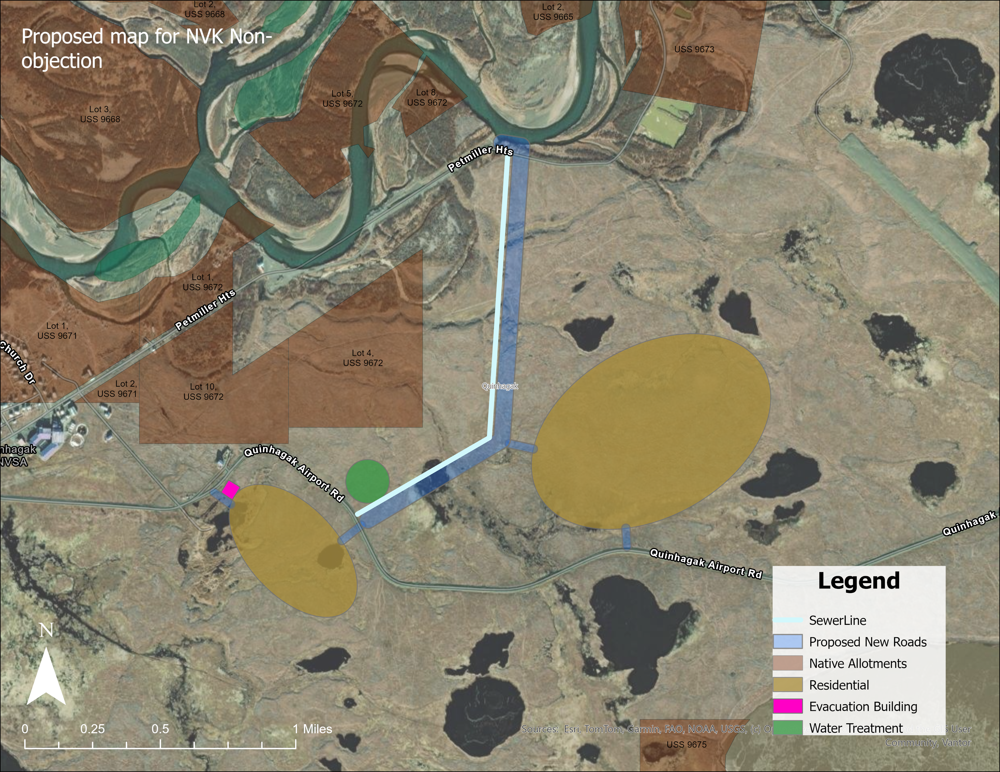

# Activity 5: FAA Development Approval Map

**Training Date:** November 18, 2025
**Duration:** 120 minutes
**Prerequisites:** Lessons 1-4, 7-9 completed, Activity 4 completed

---

## Activity Overview

Create a professional development proposal map for submission to the Federal Aviation Administration (FAA) and Native Village of Kwinhagak (NVK) requesting permission to build new housing and infrastructure near the Quinhagak airport. This map will support Quinhagak's relocation strategy in response to coastal erosion caused by Typhoons Merbok and Haloong.

---

## Learning Objectives

By completing this activity, you will be able to:

1. Import and use external ArcGIS Online layers (Calista Native Allotments)
2. Calculate buffers from restricted land areas
3. Create polygon layers for multiple proposed infrastructure types
4. Design maps for regulatory approval and stakeholder communication
5. Apply cartographic principles for official submission documents
6. Export professional maps for agency review

---

## Background

### Quinhagak Relocation Strategy

**Context:**
Following the devastating impacts of Typhoons Merbok (2022) and Haloong, the community of Quinhagak is implementing a relocation strategy to move critical infrastructure and housing further inland, away from vulnerable coastal areas.

**Development Proposal:**
On November 18, 2025, Qanirtuuq Incorporated participated in a joint meeting with the Federal Aviation Administration to request permission for new development near the airport. The proposed development includes:
- New residential housing areas
- Water treatment plant
- Evacuation building
- Sewer line infrastructure
- New road network

**Regulatory Requirements:**
- FAA approval for development near airport facilities
- Native Village of Kwinhagak non-objection letter
- Respect for Calista Native Allotment boundaries
- Compliance with local zoning requirements

**Map Purpose:**
This map will serve as the official visual documentation for:
- FAA permit application
- NVK non-objection request
- Community stakeholder communication
- Planning coordination between agencies

---

## Example Map Reference

Review the completed example map before beginning:

**File:** `../resources/example-maps/FAAproposedmap.png`



**Note the following elements:**
- Clear title indicating purpose ("Proposed map for NVK Non-objection")
- Native Allotments clearly shown and labeled
- Proposed development areas positioned to respect allotment boundaries
- Legend with all layer types
- Scale bar and north arrow
- Satellite imagery basemap for context

---

## Part 1: Project Setup (15 minutes)

### Task 1.1: Create New Map in ArcGIS Pro

1. **Launch ArcGIS Pro**
2. **Create New Project:**
   - Template: Map
   - Name: "FAA_Development_Proposal_Quinhagak"
   - Location: Your working folder
3. **Save Project**

### Task 1.2: Set Coordinate System

**Coordinate System:**
- Alaska Albers Equal Area (EPSG: 3338)
- Or NAD 1983 Alaska Zone 5

**Why This Matters:**
Accurate distance and area calculations require an appropriate projected coordinate system for Alaska.

### Task 1.3: Add Basemap

**Basemap Selection:**
1. Click "Add Data" → "Basemap"
2. Select "Imagery" or "World Imagery"
3. Zoom to Quinhagak airport area
4. Center map on proposed development site east of airport

---

## Part 2: Import Native Allotments Layer (20 minutes)

### Task 2.1: Add Calista Native Allotments from ArcGIS Online

**Why This Layer is Critical:**
The proposed roads and sewer lines must not cross Native Allotment land. This layer provides the legal boundaries that constrain development placement.

**Add Layer from ArcGIS Online:**

1. Click "Add Data" → "Data From Path"
2. Enter the ArcGIS Online URL:
   ```
   https://www.arcgis.com/home/item.html?id=5271bd1ac6bb4f7482ff7b08c3874c73
   ```
3. Or use the Portal connection:
   - Click "Portal" tab
   - Search for "Calista Native Allotments"
   - Add layer to map

**Alternative Method:**
1. Go to Insert → Connections → Add ArcGIS Online
2. Search for item ID: `5271bd1ac6bb4f7482ff7b08c3874c73`
3. Add to map

### Task 2.2: Configure Native Allotments Symbology

**Symbology Settings:**
1. Right-click layer → Symbology
2. **Fill:** Brown/tan color with 40% transparency
3. **Outline:** Dark brown, 2 pixels
4. **Labels:** Enable labels showing lot numbers (e.g., "Lot 1 USS 9671")

**Layer Properties:**
- Rename layer to "Native Allotments" in Contents pane
- Set as reference layer (not editable)

### Task 2.3: Identify Allotments in Development Area

**Document the following allotments visible in the development area:**
- Petniller Hts allotments (multiple lots)
- USS 9671, USS 9672, USS 9673 series
- Note their positions relative to proposed infrastructure

---

## Part 3: Calculate Buffer Zones (15 minutes)

### Task 3.1: Create Buffer from Native Allotments

**Purpose:** Establish setback distance from allotment boundaries for infrastructure placement

**Create Buffer:**
1. Open Geoprocessing pane
2. Search for "Buffer" tool
3. **Input Features:** Native Allotments layer
4. **Output Feature Class:** "Allotment_Buffer_Zone"
5. **Distance:** 50 feet (or per local requirements)
6. **Dissolve Type:** All
7. Run tool

### Task 3.2: Style Buffer Zone

**Symbology:**
- Fill: Light yellow, 50% transparency
- Outline: Dashed orange line, 1 pixel
- This shows the "exclusion zone" for infrastructure placement

**Note:** The buffer helps ensure that proposed development maintains appropriate setbacks from Native Allotment boundaries.

---

## Part 4: Create Proposed Sewer Line (15 minutes)

### Task 4.1: Create Sewer Line Feature Class

**Create New Feature Class:**
1. Right-click geodatabase → New → Feature Class
2. **Name:** "Proposed_Sewer_Line"
3. **Type:** Polyline
4. **Coordinate System:** Same as project

**Add Attributes:**

| Field Name | Type | Description |
|------------|------|-------------|
| Line_ID | Text (20) | Unique identifier |
| Line_Type | Text (50) | "Main", "Lateral" |
| Length_Feet | Double | Calculated length |
| Material | Text (50) | Pipe material |
| Status | Text (30) | "Proposed" |
| Notes | Text (255) | Additional information |

### Task 4.2: Digitize Sewer Line

**Drawing the Sewer Line:**
1. Start Edit Session
2. Select Proposed_Sewer_Line layer
3. Create Features → Line

**Routing Considerations:**
- Start at proposed water treatment plant location
- Route along proposed road alignments where possible
- **CRITICAL:** Avoid crossing Native Allotment boundaries
- Connect to residential areas and evacuation building
- Follow Quinhagak Airport Rd alignment

**Attributes:**
- Line_ID: SL-001
- Line_Type: "Main"
- Material: "HDPE"
- Status: "Proposed"
- Notes: "Main sewer line connecting proposed developments"

4. Calculate Length_Feet field from geometry
5. Save edits

---

## Part 5: Create Proposed Roads (15 minutes)

### Task 5.1: Create Proposed Roads Feature Class

**Create Feature Class:**
- Name: "Proposed_New_Roads"
- Type: Polyline

**Attributes:**

| Field Name | Type | Description |
|------------|------|-------------|
| Road_ID | Text (20) | Unique identifier |
| Road_Type | Text (50) | "Primary", "Secondary" |
| Width_Feet | Integer | Road width |
| Surface | Text (50) | "Gravel" |
| Length_Feet | Double | Calculated length |
| Status | Text (30) | "Proposed" |

### Task 5.2: Digitize Proposed Roads

**Drawing Roads:**
1. Create primary access road connecting to Quinhagak Airport Rd
2. Add secondary roads to residential areas
3. **CRITICAL:** Route roads to avoid Native Allotment land

**Reference the example map** to see the road network configuration with the angular connections between development areas.

**Attributes for Main Road:**
- Road_ID: R-001
- Road_Type: "Primary"
- Width_Feet: 24
- Surface: "Gravel"
- Status: "Proposed"

4. Calculate lengths and save edits

---

## Part 6: Create Residential Housing Areas (15 minutes)

### Task 6.1: Create Residential Areas Feature Class

**Create Feature Class:**
- Name: "Proposed_Residential"
- Type: Polygon

**Attributes:**

| Field Name | Type | Description |
|------------|------|-------------|
| Area_ID | Text (20) | Unique identifier |
| Area_Name | Text (100) | Descriptive name |
| Est_Units | Integer | Estimated housing units |
| Area_Acres | Double | Calculated area |
| Phase | Text (20) | Development phase |
| Status | Text (30) | "Proposed" |

### Task 6.2: Digitize Residential Areas

**Create Residential Polygons:**
Based on the example map, create polygons for the proposed residential development areas:

1. **Northern Residential Area** - Larger oval north of airport road
2. **Eastern Residential Area** - Larger oval east of main intersection
3. **Southern Residential Area** - Smaller oval south of airport road

**Placement Considerations:**
- Position to maintain buffer from Native Allotments
- Ensure road access to each area
- Connect to sewer infrastructure

**Attributes for Area 1:**
- Area_ID: RES-001
- Area_Name: "North Residential Development"
- Est_Units: 15
- Phase: "Phase 1"
- Status: "Proposed"

4. Calculate Area_Acres and save edits

---

## Part 7: Create Water Treatment Plant (10 minutes)

### Task 7.1: Create Water Treatment Feature Class

**Create Feature Class:**
- Name: "Proposed_Water_Treatment"
- Type: Polygon

**Attributes:**

| Field Name | Type | Description |
|------------|------|-------------|
| Facility_ID | Text (20) | Unique identifier |
| Facility_Name | Text (100) | Facility name |
| Capacity | Text (50) | Treatment capacity |
| Area_SqFeet | Double | Facility footprint |
| Status | Text (30) | "Proposed" |

### Task 7.2: Digitize Water Treatment Plant

**Location:**
- Position at the southern end of the sewer line
- As shown in example map (yellow polygon)

**Attributes:**
- Facility_ID: WT-001
- Facility_Name: "Quinhagak Water Treatment Plant"
- Status: "Proposed"

---

## Part 8: Create Evacuation Building (10 minutes)

### Task 8.1: Create Evacuation Building Feature Class

**Create Feature Class:**
- Name: "Proposed_Evacuation_Building"
- Type: Point

**Attributes:**

| Field Name | Type | Description |
|------------|------|-------------|
| Building_ID | Text (20) | Unique identifier |
| Building_Name | Text (100) | Facility name |
| Capacity | Integer | Person capacity |
| Status | Text (30) | "Proposed" |

### Task 8.2: Place Evacuation Building

**Location:**
- Position at central accessible location
- Near road intersection for emergency access
- As shown in example map (magenta/pink point)

**Attributes:**
- Building_ID: EB-001
- Building_Name: "Community Evacuation Building"
- Capacity: 200
- Status: "Proposed"

---

## Part 9: Apply Cartographic Styling (15 minutes)

### Task 9.1: Style Sewer Line

**Symbology:**
- Color: Light blue
- Width: 4 pixels
- Style: Solid line
- Label: "SewerLine" in legend

### Task 9.2: Style Proposed Roads

**Symbology:**
- Color: Light blue/gray
- Width: 6 pixels
- Style: Solid line with casing (if available)
- Label: "Proposed New Roads" in legend

### Task 9.3: Style Native Allotments

**Symbology:**
- Fill: Brown/tan, 50% transparency
- Outline: Dark brown, 2 pixels
- Label: "Native Allotments" in legend

### Task 9.4: Style Residential Areas

**Symbology:**
- Fill: Tan/olive color (RGB: 180, 160, 100 or similar)
- Outline: Darker tan, 2 pixels
- Transparency: 60%
- Label: "Residential" in legend

### Task 9.5: Style Evacuation Building

**Symbology:**
- Symbol: Point marker
- Color: Magenta/pink
- Size: 12 points
- Label: "Evacuation Building" in legend

### Task 9.6: Style Water Treatment

**Symbology:**
- Fill: Yellow
- Outline: Dark yellow, 2 pixels
- Transparency: 50%
- Label: "Water Treatment" in legend

---

## Part 10: Create Map Layout (15 minutes)

### Task 10.1: Insert New Layout

1. Insert → New Layout
2. **Page Size:** Letter (8.5" x 11") or Tabloid
3. **Orientation:** Landscape
4. Insert Map Frame with your map

### Task 10.2: Add Map Elements

**Title:**
- Text: "Proposed map for NVK Non-objection"
- Position: Upper left
- Font: Arial Bold, 16 pt

**Legend:**
1. Insert → Legend
2. Position: Lower right
3. Include all feature layers
4. Order items logically:
   - SewerLine
   - Proposed New Roads
   - Native Allotments
   - Residential
   - Evacuation Building
   - Water Treatment
5. Adjust spacing and font size for readability

**Scale Bar:**
1. Insert → Scale Bar
2. Style: Alternating Scale Bar
3. Units: Miles
4. Position: Lower left

**North Arrow:**
1. Insert → North Arrow
2. Style: Simple compass
3. Position: Lower left, above scale bar

### Task 10.3: Final Map Extent

**Set Map Extent:**
- Show all proposed development areas
- Include Native Allotments for context
- Include Quinhagak Airport Rd labels
- Show relationship to existing village (Quinhagak visible at edge)

---

## Part 11: Export Final Map (10 minutes)

### Task 11.1: Export to PNG

**Export Settings:**
1. Share → Export Layout
2. **Format:** PNG
3. **Resolution:** 300 DPI
4. **File Name:** "FAA_Proposed_Development_NVK_Nonobjection.png"

### Task 11.2: Export to PDF

**Export Settings:**
1. Share → Export Layout
2. **Format:** PDF
3. **Resolution:** 300 DPI
4. **File Name:** "FAA_Proposed_Development_NVK_Nonobjection.pdf"

### Task 11.3: Quality Review

**Check the following:**
- ☑ Title clearly states purpose
- ☑ All proposed development visible
- ☑ Native Allotments clearly distinguishable
- ☑ Legend includes all layers with clear labels
- ☑ Scale bar present
- ☑ North arrow present
- ☑ Roads and sewer line avoid allotment boundaries
- ☑ Text is readable
- ☑ Colors distinguish between layer types

---

## Deliverables

### Required Submissions:

1. **✓ ArcGIS Pro Project**
   - All layers created and styled
   - Layout configured
   - Project saved

2. **✓ PNG Export**
   - 300 DPI resolution
   - File: FAA_Proposed_Development_NVK_Nonobjection.png

3. **✓ PDF Export**
   - 300 DPI resolution
   - File: FAA_Proposed_Development_NVK_Nonobjection.pdf

4. **✓ Feature Classes**
   - Proposed_Sewer_Line: Complete with attributes
   - Proposed_New_Roads: Complete with attributes
   - Proposed_Residential: 3 polygons with attributes
   - Proposed_Water_Treatment: 1 polygon with attributes
   - Proposed_Evacuation_Building: 1 point with attributes

---

## Assessment Criteria

### Layer Creation and Data Quality (40 points)

**External Data Integration (10 points):**
- ✓ Native Allotments layer successfully imported
- ✓ Layer properly configured and styled
- ✓ Buffer zones calculated correctly

**Infrastructure Layers (20 points):**
- ✓ Sewer line properly routed, avoids allotments
- ✓ Roads properly routed, avoids allotments
- ✓ Residential areas appropriately sized and placed
- ✓ Water treatment and evacuation building placed logically

**Attribute Completion (10 points):**
- ✓ All required fields populated
- ✓ Calculated fields completed (lengths, areas)
- ✓ Consistent naming conventions

### Cartographic Design (35 points)

**Symbology (20 points):**
- ✓ Colors distinguish between layer types
- ✓ Native Allotments clearly visible
- ✓ Proposed infrastructure clearly visible
- ✓ Professional color scheme

**Layout Elements (15 points):**
- ✓ Title appropriate for regulatory submission
- ✓ Legend complete and well-organized
- ✓ Scale bar and north arrow present
- ✓ Overall professional appearance

### Regulatory Compliance (15 points)

**Development Placement (15 points):**
- ✓ Sewer line avoids Native Allotment land
- ✓ Roads avoid Native Allotment land
- ✓ Appropriate setbacks maintained
- ✓ Map clearly communicates compliance

### Technical Quality (10 points)

**Export Quality (10 points):**
- ✓ 300 DPI resolution
- ✓ Both PNG and PDF formats
- ✓ Correct file naming
- ✓ Print-ready quality

**Total: 100 points**

---

## Real-World Application

### How This Map Was Used:

**FAA Coordination:**
- Submitted with permit application for development near airport
- Demonstrates understanding of airspace and safety considerations
- Shows proposed infrastructure locations for FAA review

**NVK Non-Objection:**
- Presented to Native Village of Kwinhagak leadership
- Clearly shows respect for Native Allotment boundaries
- Supports formal non-objection letter request

**Interagency Coordination:**
- Shared between Qanirtuuq Incorporated, FAA, and NVK
- Provides common visual reference for discussions
- Documents agreed-upon development locations

**Outcome:**
Following the November 18, 2025 meeting and map presentation, Qanirtuuq Incorporated secured:
- Non-objection letter from NVK
- FAA approval to begin zoning and planning

This demonstrates the critical role of professional cartography in regulatory approval processes.

---

## Key Takeaways

- **External data integration** connects your work to authoritative data sources
- **Buffer analysis** helps ensure regulatory compliance with setback requirements
- **Careful routing** of linear infrastructure (roads, utilities) requires attention to land ownership
- **Maps communicate complex information** to multiple stakeholders effectively
- **Regulatory maps require precision** - errors can delay or prevent approval
- **Clear legends and titles** ensure maps can stand alone as official documents
- **Professional quality exports** reflect on the organization submitting them
- **GIS supports real community outcomes** - this map helped advance Quinhagak's relocation strategy

---

## Connection to Relocation Strategy

This activity demonstrates how the skills learned in this module directly support Quinhagak's climate adaptation and relocation efforts:

1. **Activity 3** documented damage from Typhoon Merbok
2. **Activity 4** planned the relocation site and infrastructure
3. **Activity 5** secured regulatory approval for development

Together, these maps form a complete workflow from damage assessment through planning to implementation approval.

---

**Congratulations!** You've created a regulatory approval map that contributed to real-world community development outcomes. This demonstrates professional GIS skills in stakeholder communication, regulatory compliance, and infrastructure planning.
